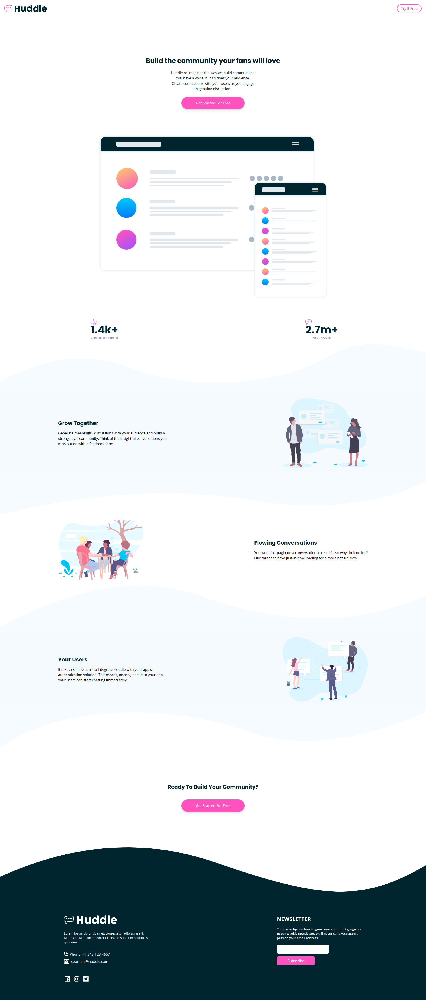
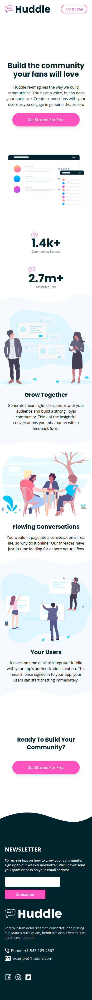

# Frontend Mentor - Huddle landing page with curved sections solution

This is a solution to the [Huddle landing page with curved sections challenge on Frontend Mentor](https://www.frontendmentor.io/challenges/huddle-landing-page-with-curved-sections-5ca5ecd01e82137ec91a50f2). Frontend Mentor challenges help you improve your coding skills by building realistic projects. 

## Table of contents

- [Overview](#overview)
  - [The challenge](#the-challenge)
  - [Screenshot](#screenshot)
  - [Links](#links)
- [My process](#my-process)
  - [Built with](#built-with)
  - [Notes](#notes)
- [Author](#author)

## Overview

### The challenge

Users should be able to:

- View the optimal layout for the site depending on their device's screen size
- See hover states for all interactive elements on the page

### Screenshot

-Desktop:

-Mobile:

### Links

- Live Site URL: [Add live site URL here](https://askr002.github.io/huddle-landing-page)

## My process

### Built with

- [React](https://reactjs.org/) - JS library
- [Vite](https://vitejs.dev) - Development environment
- [Tailwind CSS](https://tailwindcss.com) - For styles
- HTML5
- Flexbox

### Notes

- This project was built using React/Vite for ease of development/deployment. The website only uses HTML for markup and Tailwind CSS for styling.

## Author

- Github - [askr002](https://github.com/askr002)
- Linkedin - [Aswin Krishna](https://www.linkedin.com/in/aswin-krishna-9402a7206/)

